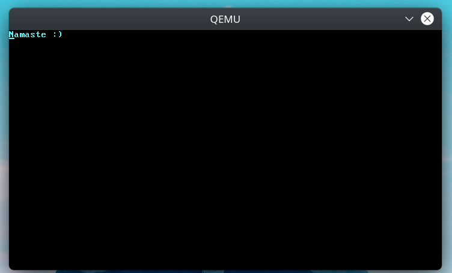

# Built following Phil-Opp's tutorial of Blog OS

https://os.phil-opp.com/

## Current State



## Running It

> Considering you have [cargo and rustup installed](https://rustup.rs/)

```sh
# Pre-requisits
rustup default nightly		# Use the nightly rust compiler (needed for building core library itself)
cargo install bootimage		# a tool which compiles the bootloader, this kernel, and links them together
rustup component add llvm-tools-preview	# required by bootimage

# Now building and running
cargo bootimage
qemu-system-x86_64 -drive format=raw,file=target/x86_64-blog_os/debug/bootimage-minimal-rust-kernel.bin
```

### Differences

Instead of all in kernel code, (kind of too much modularisation), i separated things like VGA (that are totally independent) in a new crate, similar are in the `modules/` directory.

## Browsing through steps
Use the tags

